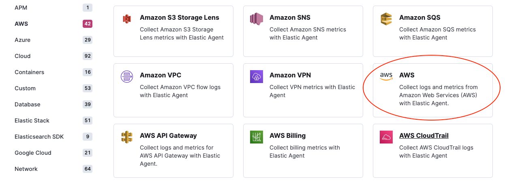
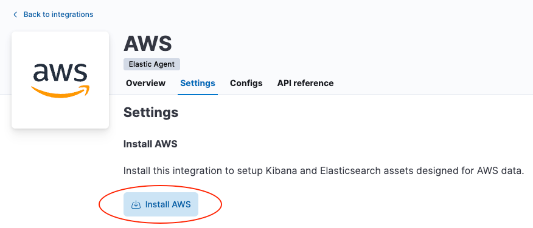
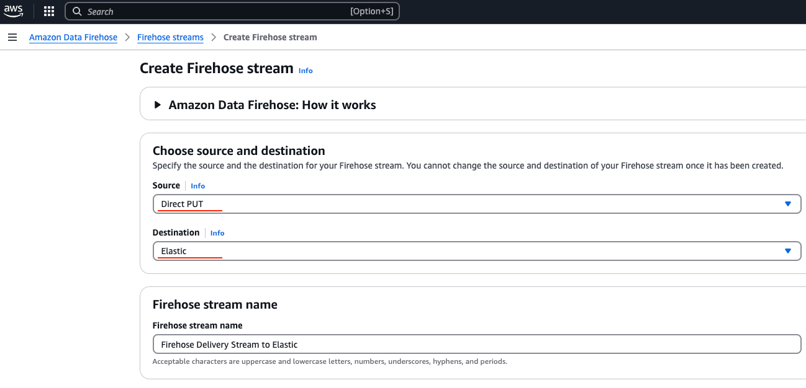
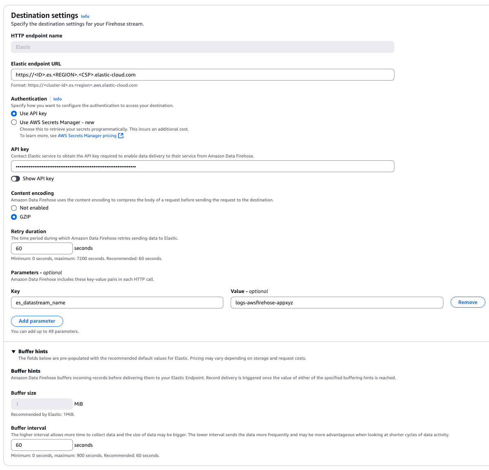

# Amazon Data Firehose
Amazon Data Firehose integration offers users a way to stream logs and CloudWatch metrics from Firehose to Elastic Cloud.
This integration includes predefined rules that automatically route AWS service logs and CloudWatch metrics to the respective integrations, which
include field mappings, ingest pipelines, and predefined dashboards. 

Here is a list of log types that are supported by this integration:

| AWS service log    | Log destination          |
|--------------------|--------------------------|
| API Gateway        | CloudWatch               |
| CloudFront         | S3                       |
| CloudTrail         | CloudWatch               |
| ELB                | S3                       |
| Network Firewall   | Firehose, CloudWatch, S3 |
| Route53 Public DNS | CloudWatch               |
| Route53 Resolver   | Firehose, CloudWatch, S3 |
| S3 access          | S3                       |
| VPC Flow           | Firehose, CloudWatch, S3 |
| WAF                | Firehose, CloudWatch, S3 |

Here is a list of CloudWatch metrics that are supported by this integration:

| AWS service monitoring metrics |
|--------------------------------|
| API Gateway                    |
| DynamoDB                       |
| EBS                            |
| EC2                            |
| ECS                            |
| ELB                            |
| EMR                            |
| Network Firewall               |
| Kafka                          |
| Kinesis                        |
| Lambda                         |
| NATGateway                     |
| RDS                            |
| S3                             |
| S3 Storage Lens                |
| SNS                            |
| SQS                            |
| TransitGateway                 |
| Usage                          |
| VPN                            |

## Limitation
It is not possible to configure a delivery stream to send data to Elastic Cloud via PrivateLink (VPC endpoint). 
This is a current limitation in Firehose, which we are working with AWS to resolve.

## Instructions
1. Install the relevant integrations in Kibana

    In order to make the most out of your data, first install the **AWS integration** to load index templates, ingest pipelines, and 
    dashboards into Kibana. For this, in Kibana, navigate to **Management** > **Integrations** in the sidebar.
    Find the **AWS** integration by searching or browsing the catalog.
    
    
    
    Navigate to the **Settings** tab and click **Install AWS assets**. Confirm by clicking **Install AWS** in the popup.
    
    

2. Create a delivery stream in Amazon Data Firehose

    Sign into the AWS console and navigate to Amazon Data Firehose. Click **Create Firehose stream**.
    Configure the delivery stream using the following settings:
    
    
    
    **Choose source and destination**
    
    Unless you are streaming data from Kinesis Data Streams, set source to **Direct PUT** (see Setup guide for more details on data sources).
    
    Set destination to **Elastic**.
    
    **Delivery stream name**
    
    Provide a meaningful name that will allow you to identify this delivery stream later.
    
    
    
    **Destination settings**

    1. Set **Elastic endpoint URL** to point to your **Elasticsearch** cluster running in Elastic Cloud.
    This endpoint can be found from the [Elastic Cloud console](https://cloud.elastic.co/).

    2. **API key** is the base64 encoded Elastic API key.
    This can be created in Kibana by following the instructions under API Keys.
    If you are using an API key with Restricted privileges, be sure to review the Indices privileges to provide at least "auto_configure" & "write" permissions for the indices you will be using with this delivery stream.
    By default, logs will be stored in `logs-awsfirehose-default` data stream and metrics will be stored in `metrics-aws.cloudwatch-default` data stream.
    Therefore, Elastic highly recommends giving `logs-awsfirehose-default` and `metrics-aws.cloudwatch-default` indices with "write" privilege.

    3. We recommend setting **Content encoding** to **GZIP** to reduce the data transfer costs.

    4. **Retry duration** determines how long Firehose continues retrying the request in the event of an error. 
    A duration between 60 and 300 seconds should be suitable for most use cases.

    5. Elastic requires a **Buffer size** of `1MiB` to avoid exceeding the Elasticsearch `http.max_content_length` setting (typically 100MB) when the buffer is uncompressed.

    6. The default **Buffer interval** of `60s` is recommended to ensure data freshness in Elastic.

    7. **Parameters**

       1. `es_datastream_name`: Accepts a data stream name of your choice.
       You can configure this when you ingest data formats that are not officially supported and managed through your customized data streams.
       Also, you may use this to separate your ingested data from default indexes.
       By default, logs will be stored in indexes of `logs-awsfirehose-default` (index template `logs-awsfirehose`) data stream and metrics will be stored in indexes of `metrics-aws.cloudwatch-default` (index template `metrics-aws.cloudwatch`) data stream.
       When configuring, please make sure configured **API key** has required permissions to ingest data into the configured data stream. 

       2. `include_cw_extracted_fields`: Optional parameter that can be set when using a CloudWatch logs subscription filter as the Firehose data source.
       When set to true, extracted fields generated by the filter pattern in the subscription filter will be collected.
       Setting this parameter can add many fields into each record and may significantly increase data volume in Elasticsearch.
       As such, use of this parameter should be carefully considered and used only when the extracted fields are required for specific filtering and/or aggregation.

    8. **Backup settings** It is recommended to configure S3 backup for failed records. These backups can be used to restore lost data caused by unforeseen service outages.

        

3. Send data to the Firehose delivery stream
    1. logs
    Consult the [AWS documentation](https://docs.aws.amazon.com/firehose/latest/dev/basic-write.html) for details on how to
    configure a variety of log sources to send data to Firehose delivery streams.

    2. metrics
    Consult the [AWS documentation](https://docs.aws.amazon.com/AmazonCloudWatch/latest/monitoring/CloudWatch-metric-streams-setup.html)
    for details on how to set up a metric stream in CloudWatch and 
    [Custom setup with Firehose](https://docs.aws.amazon.com/AmazonCloudWatch/latest/monitoring/CloudWatch-metric-streams-setup-datalake.html) 
    to send metrics to Firehose. For Elastic, we only support JSON and OpenTelemetry 1.0.0 formats for the metrics.

## Logs reference

**Exported fields**

| Field | Description | Type |
|---|---|---|
| @timestamp | Date/time when the event originated. This is the date/time extracted from the event, typically representing when the event was generated by the source. If the event source has no original timestamp, this value is typically populated by the first time the event was received by the pipeline. Required field for all events. | date |
| aws.cloudwatch.log_group | CloudWatch log group name. | keyword |
| aws.cloudwatch.log_stream | CloudWatch log stream name. | keyword |
| aws.firehose.arn | Firehose ARN. | keyword |
| aws.firehose.parameters.\* | Key-value pairs users set up when creating the Kinesis Data Firehose. These parameters are included in each HTTP call. | flattened |
| aws.firehose.request_id | Firehose request ID. | keyword |
| aws.firehose.subscription_filters | Firehose request ID. | keyword |
| aws.kinesis.name | Kinesis name. | keyword |
| aws.kinesis.type | Kinesis type. | keyword |
| data_stream.dataset | The field can contain anything that makes sense to signify the source of the data. Examples include `nginx.access`, `prometheus`, `endpoint` etc. For data streams that otherwise fit, but that do not have dataset set we use the value "generic" for the dataset value. `event.dataset` should have the same value as `data_stream.dataset`. Beyond the Elasticsearch data stream naming criteria noted above, the `dataset` value has additional restrictions:   \* Must not contain `-`   \* No longer than 100 characters | constant_keyword |
| data_stream.namespace | A user defined namespace. Namespaces are useful to allow grouping of data. Many users already organize their indices this way, and the data stream naming scheme now provides this best practice as a default. Many users will populate this field with `default`. If no value is used, it falls back to `default`. Beyond the Elasticsearch index naming criteria noted above, `namespace` value has the additional restrictions:   \* Must not contain `-`   \* No longer than 100 characters | constant_keyword |
| data_stream.type | An overarching type for the data stream. Currently allowed values are "logs" and "metrics". We expect to also add "traces" and "synthetics" in the near future. | constant_keyword |

## Metrics reference

**Exported fields**

| Field | Description | Type | Metric Type |
|---|---|---|---|
| @timestamp | Date/time when the event originated. This is the date/time extracted from the event, typically representing when the event was generated by the source. If the event source has no original timestamp, this value is typically populated by the first time the event was received by the pipeline. Required field for all events. | date |  |
| aws.\*.metrics.\*.\* | Metrics that returned from Cloudwatch API query. | object | gauge |
| aws.cloudwatch.namespace | The namespace specified when query cloudwatch api. | keyword |  |
| aws.dimensions.\* | Metric dimensions. | keyword |  |
| aws.exporter.arn | The metric stream Amazon Resource Name (ARN). | keyword |  |
| aws.firehose.arn | Amazon Resource Name (ARN) for the firehose stream. | keyword |  |
| aws.firehose.parameters.\* | Key-value pairs users set up when creating the Kinesis Data Firehose. These parameters are included in each HTTP call. | flattened |  |
| aws.firehose.request_id | HTTP request opaque GUID. | keyword |  |
| aws.metrics_names_fingerprint | Autogenerated ID representing the fingerprint of the list of metrics names. For metrics coming in from Firehose, there can be cases two documents have the same timestamp, dimension, namespace, accountID, exportARN and region BUT from two different requests. With TSDB enabled, we will see documents missing if without aws.metrics_names_fingerprint field. | keyword |  |
| cloud.account.id | The cloud account or organization id used to identify different entities in a multi-tenant environment. Examples: AWS account id, Google Cloud ORG Id, or other unique identifier. | keyword |  |
| cloud.region | Region in which this host, resource, or service is located. | keyword |  |
| data_stream.dataset | The field can contain anything that makes sense to signify the source of the data. Examples include `nginx.access`, `prometheus`, `endpoint` etc. For data streams that otherwise fit, but that do not have dataset set we use the value "generic" for the dataset value. `event.dataset` should have the same value as `data_stream.dataset`. Beyond the Elasticsearch data stream naming criteria noted above, the `dataset` value has additional restrictions:   \* Must not contain `-`   \* No longer than 100 characters | constant_keyword |  |
| data_stream.namespace | A user defined namespace. Namespaces are useful to allow grouping of data. Many users already organize their indices this way, and the data stream naming scheme now provides this best practice as a default. Many users will populate this field with `default`. If no value is used, it falls back to `default`. Beyond the Elasticsearch index naming criteria noted above, `namespace` value has the additional restrictions:   \* Must not contain `-`   \* No longer than 100 characters | constant_keyword |  |
| data_stream.type | An overarching type for the data stream. Currently allowed values are "logs" and "metrics". We expect to also add "traces" and "synthetics" in the near future. | constant_keyword |  |
| start_timestamp | Date/time when the monitoring cycle started. | date |  |
